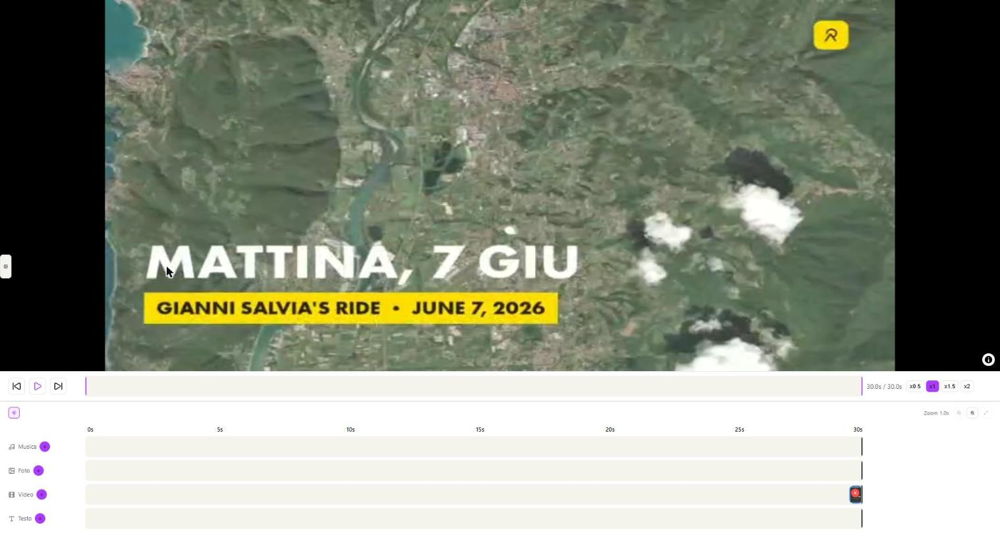

# GPX Flyover — Editor Video

**Trasforma una traccia GPX in un video con volo 3D animato sopra il percorso**, con la possibilità di inserire nella timeline anche **clip video** (action cam, riprese aggiuntive) oltre a musica e foto — tutto elaborato nel browser, senza caricare nulla su un server.

*A browser-based tool that turns a GPS track (GPX file) into a cinematic 3D flyover video over satellite terrain, with a full timeline editor for music, photos and video clips — fully local, no upload, no subscription.*



## Cosa fa in più rispetto alla versione base

Questa è la versione con l'editor video, basata su [GPX-FlyOver](https://github.com/Aieie78/GPX-FlyOver). In più:

- **Corsia Video** nella timeline: importa clip (action cam, drone, ecc.), trascina per posizionarle e ritagliarle dai bordi
- Audio della clip con **ducking automatico** della musica di sottofondo (si abbassa con dissolvenza quando un video con audio è attivo)
- Il volo/la mappa si congela mentre una clip video o una foto sono a schermo
- In esportazione a velocità diversa da x1, la finestra della clip si adatta mantenendo il contenuto sorgente al suo ritmo naturale

Tutte le altre funzionalità (multi-traccia, camera, statistiche live, musica/foto, selezione intervallo di export, salvataggio progetto) sono identiche alla versione base — vedi il [manuale completo](istruzioni.html) ([PDF](istruzioni.pdf)) per il dettaglio di ogni campo.

## Avvio rapido

Serve [Node.js](https://nodejs.org) (LTS) e una chiave API gratuita di [MapTiler](https://cloud.maptiler.com) (per le mappe satellitari/terreno 3D).

```bash
cd gpx-flyover-app
npm install
npm run dev
```

Oppure lancia `scripts/avvia.bat` (Windows) — apre il browser automaticamente.

**Pacchetto portatile** (senza bisogno di riclonare/compilare su un altro PC): `scripts/build-produzione.bat` genera in `gpx-flyover-app/portable/` un pacchetto pronto — basta Node.js installato, si avvia con `Avvia GPX Flyover.lnk`.

## Licenza

[MIT](LICENSE) — © 2026 AIELLO Roberto

Se il tool ti è utile, puoi offrire un caffè via [PayPal](https://paypal.me/Aieie78) (vedi il pulsante "Sponsor" in alto).
